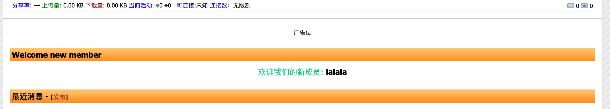

## 版本记录

- 0.1.0：初始发布，首页欢迎新用户模块。

## 安装

` composer config repositories.mx-welcome git https://github.com/maoxian-1/nexusphp-mx-welcome.git `

` composer require maoxian/nexusphp-mx-welcome `

` php artisan plugin install maoxian/nexusphp-mx-welcome `

## 效果展示

